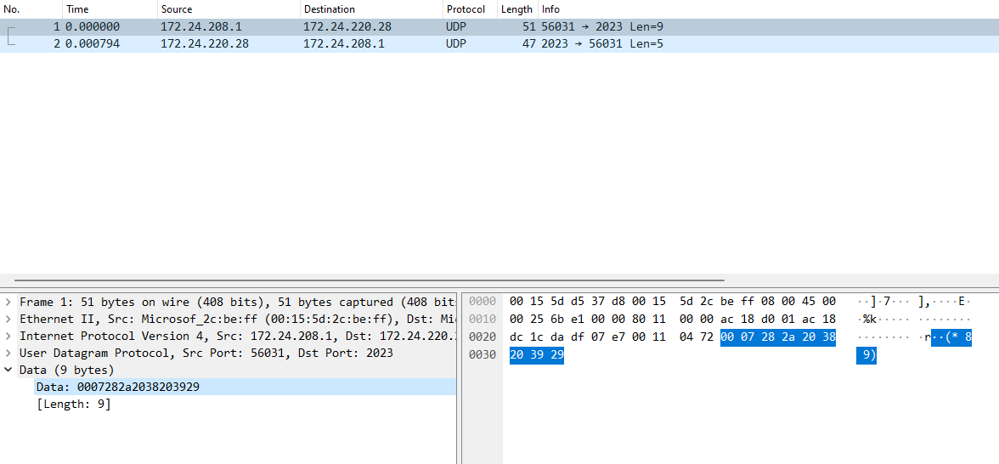

# IPK-1-Projekt - IPKCPC

## Table of Contents
[Summary](#summary)  
[Schemas](#schemas)  
[Testing](#testing)  
[Extra features](#extra-features)  
[Sources](#sources)  

## Summary
`Ipkcpc` is a console client for AaaS type applications that use `ipkd` [1] protocol. Client supports both UDP, binary, and TCP, textual, connections.  
For managing the connection it is using `UdpClient` and `TcpClient` classes from the `System.Net.Sockets` namespace [2] 

### Requirements
- [.NET6](https://dotnet.microsoft.com/en-us/)

Default makefile target builds the project for 64bit linux OS. But it can be built for any .NET6 supported system by `make build`.

### Usage
If built by default `make` target   
`ipkcpc --host|-h <HOST> --port|-p <PORT> --mode|-m <udp|tcp>`  

If built by calling `make build` or `dotnet build`  
`dotnet run -- --host|-h <HOST> --port|-p <PORT> --mode|-m <udp|tcp>`  

## Schema
  
Schema, created with yuml [3], is showing public methods and attributes.  
On program start, connection object gets created with either tcp or udp connection object stored as `connector`, which is returned by get connector. Main loop then calls `Send` and then `Receive` method until either `EOF` is read, or `<c-c>`, both terminating the connection and exiting the client. For tcp mode, receiving `BYE` also terminates the connection.

## Testing
Testing was mainly done by hand by running the program. I also had few launch profiles in visual studio to make it faster. Some "tests" were also done using wireshark [4], mainly to check if payloads were properly constructed.  
  
Wireshark being used to check message content.  

Sadly, I had problems with running the reference server on my local machine. Probably issue between the keyboard and the chair, so tests were done on python server [5] that implemented `ipkd` protocol.

Automatic test could have been done. But if I wanted to test only the client part it would have very limited scope, since I do not think expecting certain responses from server would be correct.

## Extra features
Compared to the assigment I have added  
- Warning messages if received udp datagram is not whats expected (err, request instead of response)
- Long form of arguments (thanks System.CommandLine [6])
- Information messages about connection termination
- If built in `Debug` configuration stack traces on errors, not showing if build in `Release`

## Sources
[1] [IPK Calculator Protocol](https://git.fit.vutbr.cz/NESFIT/IPK-Projekty/src/branch/master/Project%201/Protocol.md)  
[2] [System.Net.Sockets](https://learn.microsoft.com/en-us/dotnet/api/system.net.sockets)  
[3] [yuml.me](https://yuml.me/)  
[4] [Wireshark](https://www.wireshark.org/)  
[5] [Python server](https://gist.github.com/lavirlifiliol/0f0c4a36b8a92189b785065ebd7a32b7)  
[6] [System.CommandLine](https://learn.microsoft.com/en-us/dotnet/standard/commandline/)
