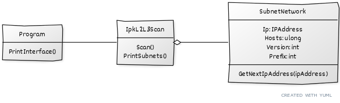

# IPK-2-Projekt - IPK-L2L3-SCAN

## Table of contents
- [Summary](#summary)
    - [Requirements](#requirements)
    - [Usage](#usage)
- [Implementation](#implementation)
    - [Used libraries](#used-libraries)
    - [Schema](#schema)
    - [Limitations](#limitations)
    - [Known issues](#known-issues)
- [Testing](#testing)
    - [Automatic tests](#automatic-tests)
- [Examples](#examples)
- [More reading](#more-reading)

## Summary
`ipk-l2l3-scan` is a console application for scanning L2 and L3 devices present given network segments. Applications fully supports IPv4 and partly IPv6 (more in [Known issues](#known-issues)).   

### Requirements
- [.NET6](https://dotnet.microsoft.com/en-us/)

Default makefile target builds the project for 64bit linux OS. But it can be built for any .NET6 supported system by calling `dotnet build`.

### Usage
If built by default `make` target:
```
./ipk-l2l3-scan [-i <interface>|--interface <interface>] [-s <subnet>|--subnet <subnet>] [-w <timeout> | --wait <timeout>]
``` 
If built by calling `dotnet build`:
```
./dotnet run -- [-i <interface>|--interface <interface>] [-s <subnet>|--subnet <subnet>] [-w <timeout> | --wait <timeout>]
```
You might need to move into the main project folder `IPK-2-PROJECT` for it to run.

Where:
- `-i | --interface` Sets the interface to scan from. If not set or missing list of active interfaces is printed.
- `-w | --wait` Sets the timeout, in ms, for each part of scan. If not set or missing it defaults to 5000 (5s).
- `-s | --subnet` Sets the subnet to scan in format `IPAddress/prefix`. If not set or missing list of active interfaces is printed.  

Subnet argument can be repeated multiple times, program will then scan all inputed subnets.  

#### Important information
Program uses raw sockets, on most system it will **need to be run with admin permissions**.

#### Usage examples
```
./ipk-l2l3-scan -i eth0 -w 500 -s 192.168.0.0/25 -s fe80::1234/90
./ipk-l2l3-scan -i \Device\NPF_{ECFD0E9C-0EA0-4A03-AB9E-DF47E26A92A2} -s 192.168.1.0/24
```

## Implementation
Program is implemented using system sockets and libraries listed below. Main reason for the libraries is that c# is a high level language and these libraries allowed me to do few low level things needed.  

Program parses each subnet into its own object, computing network address and amount of hosts from prefix. Then for each address it sends ARP/NDP and ICMPv4/v6 messages, depending on IP version of subnet.  

Program first outputs network addreses it will scan with the calculated host amount.
Then for each scanned address outputs its IP, ARP/NDP FAIL or OK, ARP also prints address, then ICMPv4/v6 OK or FAIL.

### Exit codes
- 0 - No error
- 1 - Invalid arguments
- 2 - Invalid IP address
- 3 - Invalid prefix
- 4 - Invalid interface
- 5 - Unsopported prefix

### Used libraries
- [SharpPcap](https://github.com/dotpcap/sharppcap)
- [PacketNet](https://github.com/dotpcap/packetnet)
- [xUnit](https://xunit.net/)

### Schema


### Limitations
IPv6 prefix is limited. Program does not accept lower prefixes than /64 like /5 etc.  
Hosts are stored as ulongs (uint64), and .NET 6 does not support uints128. I also do not see a single reason to scan more than 2^64 addresses in the first place.

### Known issues
IPv6 NDP probably is not working as intended. I could not make it work on my local network. Packet is in the right format, but the only other IPv6 device that I known would not repond to it. But after packet sent by the program, identical packet would go through even with a reponse.  
Because of this, I only check if anything gets sent as a response. Since I dont know what I actually get after it goes through all the c# abstraction layers, the program does not check if its valid neighbor advertisement packet and whats the mac address.  
If anyone sees the mistake in code, or knows where to get the mac address from reponse, I would really appreciate an issue/pull request. Thanks in advance.

## Testing
What can be tested on any device was tested using xUnit. Tests can be re-run by `dotnet test`. 
Actual packet transmission, checking if they are correct was done manually using Wireshark.

### Automatic tests
Code for tests can be found in `IPK-2-Projekt-Tests` Project  

Automatic tests are testing:
- Proper subnet parsing (IPv4 and IPv6)
    - Amount of hosts
    - Network address
    - Proper prefix extraction
- Proper IP increase (For use in scanning loop)

## Example
Scanning IPv4 on my local network
```
./ipk-l2l3-scan -i -i \Device\NPF_{ECFD0E9C-0EA0-4A03-AB9E-DF47E26A92A2} -s 192.168.1.170/28 -w 500
Scanning ranges:
192.168.1.160/28 (14 hosts)
192.168.1.161   arp FAIL, icmpv4 FAIL
192.168.1.162   arp FAIL, icmpv4 FAIL
192.168.1.163   arp FAIL, icmpv4 FAIL
192.168.1.164   arp FAIL, icmpv4 FAIL
192.168.1.165   arp FAIL, icmpv4 FAIL
192.168.1.166   arp FAIL, icmpv4 FAIL
192.168.1.167   arp FAIL, icmpv4 FAIL
192.168.1.168   arp FAIL, icmpv4 FAIL
192.168.1.169   arp FAIL, icmpv4 FAIL
192.168.1.170   arp FAIL, icmpv4 FAIL
192.168.1.171   arp FAIL, icmpv4 OK
192.168.1.172   arp OK (38:8B:59:09:26:4C), icmpv4 OK
192.168.1.173   arp FAIL, icmpv4 FAIL
192.168.1.174   arp FAIL, icmpv4 FAIL
```

## More reading
Want to know more in depth how this actually works? If yes, I would recommend taking a look at these things:
- RFC 792 - Internet Control Message Protocol
- RFC 826 - An Ethernet Address Resolution Protocol
- RFC 4443 - Internet Control Message Protocol (ICMPv6) for the Internet Protocol Version 6 (IPv6) Specification
- RFC 4861 - Neighbor Discovery for IP version 6 (IPv6)