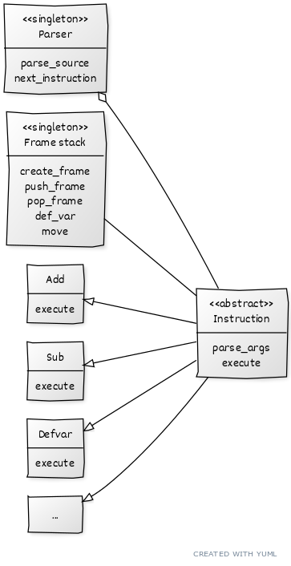

## Implementační dokumentace k 2. úloze do IPP 2022/2023
## Jméno a příjmení: Radim Šafář
## Login: xsafar27
---

# 2. Úloha do IPP 2022/2023

## Obsah
- [Souhrn](#souhrn)
    - [Použití](#použití)
    - [Požadavky](#požadavky)
    - [Testování](#testování)
- [Implementace](#implementace)
    - [Použité knihovny](#použité-knihovny)
    - [Schéma](#schéma)
    - [Chybové kódy](#chybové-kódy)
- [Co chybí](#co-chybí)
    - [Funkcionalita "label"](#funkcionalita-label)
    - [Částečně přehlednost](#částečně-přehlednost)
- [Odkazy](#odkazy)

## Souhrn
`Interpret.py` je konzolová aplikace na interpretaci `IPPcode23`. Aplikace načtě zdrojový kód a následně ho interpretuje. Bohužel není implementovaná celá "základní" funkcionalita dle zadaní, více v [Co chybí](#co-chybí).

### Požadavky
Na spuštění aplikace je třeba `Python 3.10` [1]

### Použití
```
./interpret.py [--source [SOURCE]] [--input [INPUT]] [-h|--help]
python3.10 interpret.py [--source [SOURCE]] [--input [INPUT]] [-h|--help]
```
Kde:
- `--source` Nastaví soubor, ze kterého je čten zdrojový kód ve formátu XML.
- `--input` Nastaví soubor, ze kterého jsou čteny vstupy pro příkaz `READ`.
- `-h|--help` Vytiskne nápovědu k programu.  

Alespoň jeden z `--source` či `--input` musí být zadán. Nezadaný je následně čten z `stdin`.

### Testování
Testování aplikace bylo prováděno primárně unit testy. Ať už od pana doktora Křivky, či studenskými doplňky. Některé složitější nebo méně pochopitelné problémy byly testovány ručně.

## Implementace
Při implementaci byl použit návrhový vzor `Singleton - Jedináček`. Prvotně byla myšlenka využít `Visitor pattern`. Ten byl ale pro neúplné pochopení opuštěn, ale je možné vidět některé jeho prvky v návrhu.  
Hlavními součástmi aplikace jsou třídy `Parser`, `Frame_stack` a abstraktní třída `Instruction`. Jedináček `Parser` má na starosti rozparsování vstupního xml dokumentu, následně vytváří nové specializované instance třídy `Instruction`, na které pak volá metodu `execute()`. Tímto se program interpretuje příkaz po příkazu. Jedináček `Frame_stack` primárně drží rámce pro proměnné, ale z důvodu špatného návrhu následně obsahuje i další věci.  
Aplikace v hlavním cyklu získává od `Parser` další instrukci v pořadí, následně instrukci zpracuje a vykoná. V případě chyby ji výpíše na `stderr` a program se ukončí s definovaným výstupním kódem (viz. [Chybové kódy](#chybové-kódy))

### Použité knihovny
- xml.etree.ElementTree [2]

### Schéma 

[3]

### Chybové kódy
Aplikace dle zadání má různé specifické kódy pro nejrůznější chyby. Zároveň na `stderr` vypisuje chybovou hlášku, pro lepší zjištění chyby v programu.  
Zde je výčet chybových kódu a jejich důvodů:
- 10 - Chybí oba parametry (jak `--source` tak `--input`).
- 11 - Chyba při otvírání souborů (soubor neexistuje).
- 31 - Chybný formát vstupního XML souboru (není tzv. well-formed).
- 32 - Neočekávaná struktura vstupního XML souboru (argumenty mimo instrukci, špatné množství argumentů atd.).
- 52 - Sémantické chyby.
- 53 - Špatné typy operandů (int ve fci vyžadující string).
- 54 - Přístup k neinicializované proměnné.
- 55 - Přístup k neexistujícímu rámci.
- 56 - Chybějící hodnota proměnné.
- 57 - Špatná hodnota operandů (-5 ve fci vyžadující kladné hodnoty).
- 58 - Chybná práce s řetězcem.
- 99 - Interní chyba aplikace.

## Co chybí
Nerad skrývám nefunkční věci. Důvodem pro tyto věci je primárně mé špatné hospodření s časem.

### Funkcionalita "label"
Aplikace nepodporuje příkaz `Label` a tedy ani nic, co ho vyžaduje. Např. skoky či volání uživatelských funkcí.

### Částečně přehlednost
Při přidávání nové a nové funkcionality jsem si uvědomil, že v jsem v návrhu nemyslel na pár podstatných věcí. Proto jsem je vložil do tříd, kde by nejspíš být neměli, a snížil tak přehlednost kódu.

## Odkazy
[1] https://python.org  
[2] https://docs.python.org/3/library/xml.etree.elementtree.html  
[3] https://yuml.me